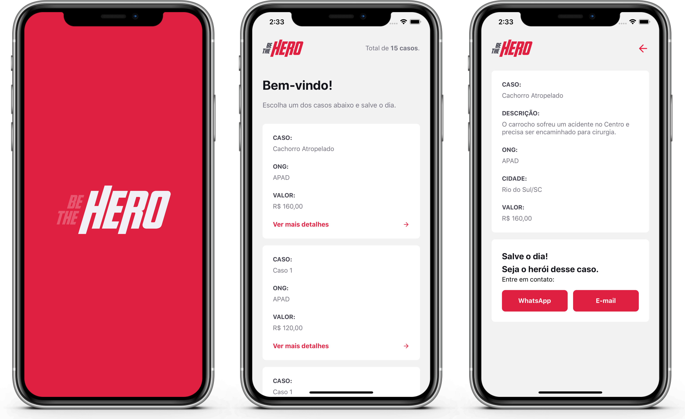
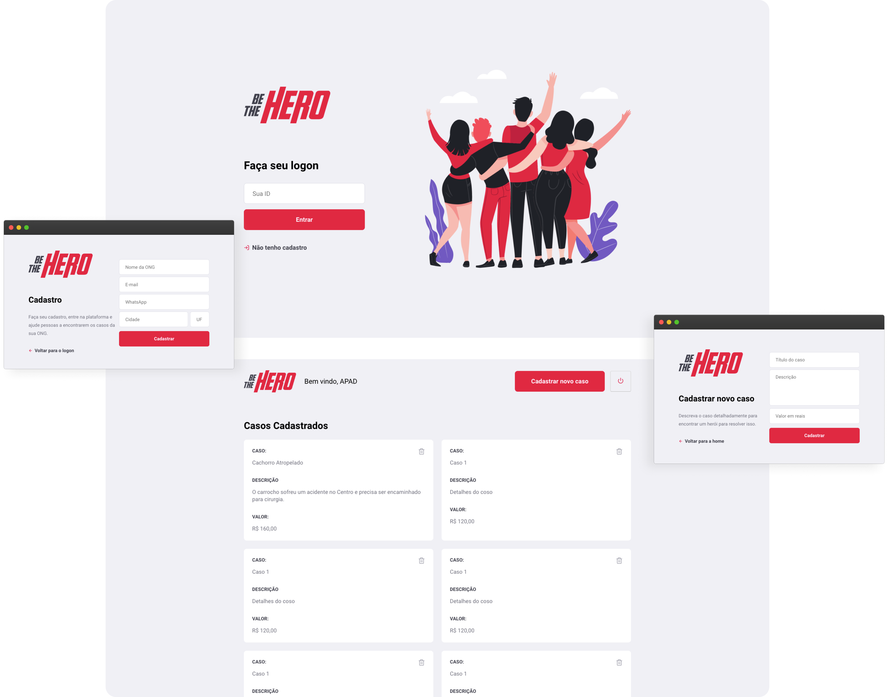

<h1 align="center">
    
</h1>

<h4 align="center">
  O Be The Hero conecta ONGs com pessoas que desejam ajudar um caso a ser resolvido, o projeto foi desenvolvido durante a Semana OmniStack 11 da Rocketseat.
</h4>

## App para Android e iOS

  

## Interface Web

  

## :boom: Executar

### :globe_with_meridians: Backend

Intale o [Node.js](https://nodejs.org/) e no diretório `backend` execute `npm install` e `npm start`.

### :computer: Web

Com o [Node.js](https://nodejs.org/) instalado no diretório `frontend` execute `npm install` e `npm start`.

### :iphone: Mobile

Com o [Node.js](https://nodejs.org/) instalado execute `npm install expo-cli --global` e no diretório `mobile` execute `expo start`, instale o app Expo no dispositivo móvel e escanei o QR Code.

## :book: Tecnologias

Desenvolvido com:

- [Node.js](https://nodejs.org/en/)
- [Express.js](https://expressjs.com/)
- [Knex.js](https://knexjs.org/)
- [React](https://reactjs.org)
- [React Router](https://reacttraining.com/react-router/)
- [React Native](https://facebook.github.io/react-native/)
- [React Navigation](https://reactnavigation.org/)
- [Expo](https://expo.io/)

## :art: Layout

O layout da aplicação foi desenvolvido pela Rocketseat no Figma e pode ser acessado através [desse link](https://www.figma.com/file/2C2yvw7jsCOGmaNUDftX9n/Be-The-Hero---OmniStack-11).

## :memo: Licença

Esse projeto está sob a licença MIT. Veja o arquivo [LICENSE](LICENSE) para mais detalhes.
